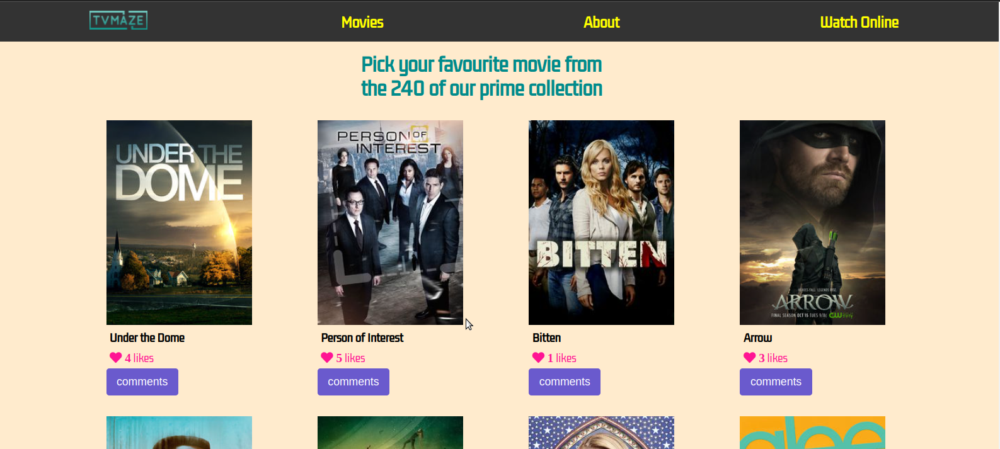
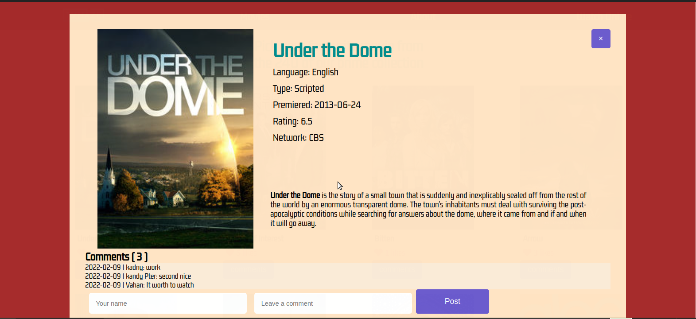

# Title

JavaScript capstone project - API-based webapp

> The JavaScript capstone project about building web application based on the external TVmaze API: data about TV series and movies.API with 2 user interfaces.

## Built With

- HTML
- CSS
- JavaScript
- Webpack
- Jest

## Live Demo

[Live Demo Link]()

## Video Link

[Video Link]()

## Getting Started

To get a local copy up and running follow these simple example steps:

### Prerequisites

clone repo: `https://github.com/Gegardus/JS-Capstone-Webapp`

then
`cd Awesome-Books`

### Install

run `npm install` to install dependencies

## Contribute

Contributions, issues, and feature requests are welcome!

Feel free to check the [issues page](https://github.com/Gegardus/JS-Capstone-Webapp/issues)

## Author

👤 **Vahan Khachvankian**

- GitHub: [@githubhandle](https://github.com/Gegardus)
- Twitter: [@twitterhandle](https://twitter.com/Gegardus)

## Author

👤 **Kandy Peter Kamuntu**

- GitHub: [@githubhandle](https://github.com/Kandy-Peter)
- Twitter: [@twitterhandle](https://twitter.com/peter_kandy)

## Acknowledgements

The authors highly appreciate the help in the project from all the participants of this week's program for the timely response to all questions from our team.

## 📝 License

This project is [MIT](./MIT.md) licensed.
